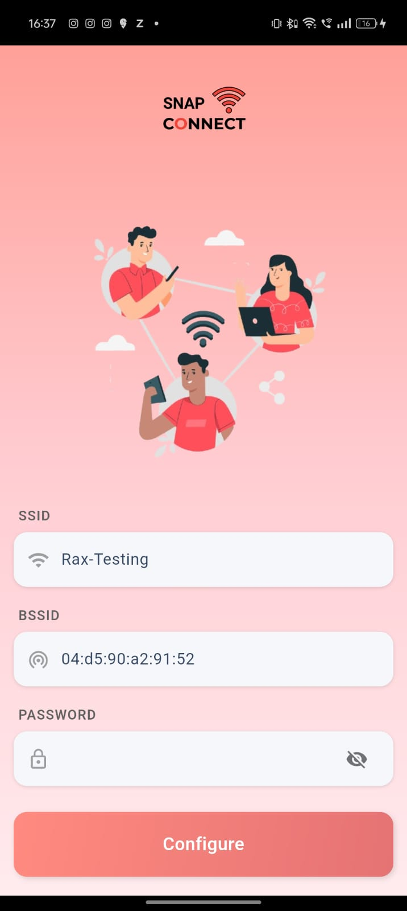
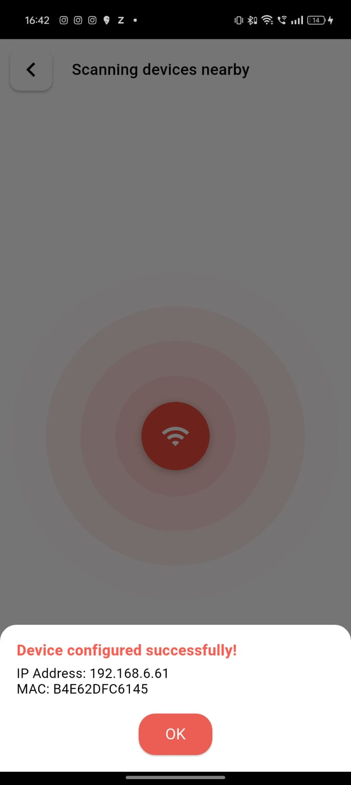
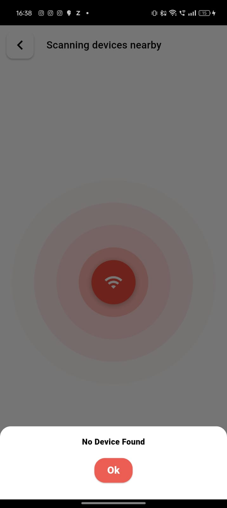

# Smart Config App (Flutter + ESP-Touch)

A Flutter-based mobile application for configuring IoT devices over Wi-Fi using the **ESP-Touch protocol**. This app allows users to easily connect ESP32/ESP8266 devices to a Wi-Fi network using SmartConfig.

---

## 🚀 Features

- 📶 **Wi-Fi Configuration** via ESP-Touch (SmartConfig)
- 🔍 Automatically discovers ESP devices on the local network
- ✅ Provides feedback on configuration status (Success/Failure)
- 🌐 Works with both 2.4GHz Wi-Fi networks and ESP-based IoT boards
- 🧭 Clean and minimal UI built with Flutter

---

## 📱 Screenshots

### 🏠 Splash Screen


### 📶 Configuring Wi-Fi


### ✅ Success Message


### ✅ No Device Message


---

## 🛠️ Getting Started

### Prerequisites

- Flutter SDK installed
- Android Studio / VS Code
- ESP32 or ESP8266 device with SmartConfig support

### Installation

1. **Clone the repository:**
   ```bash
   git clone https://github.com/yourusername/smart_config_flutter.git
   cd smart_config_flutter
